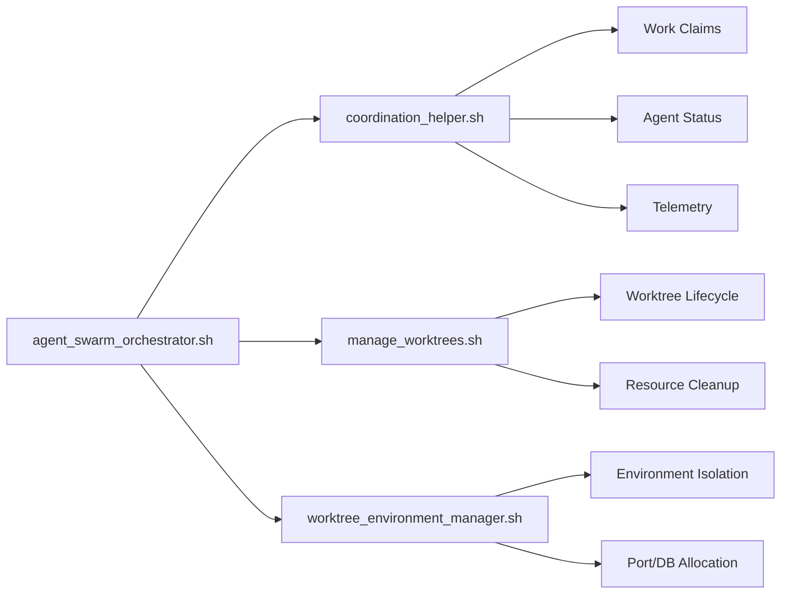

# Agent Swarm Operations Guide
## S@S Coordination + Claude Code CLI + Worktree Integration

> **Complete guide to orchestrating AI agent swarms using shell scripts, S@S coordination, and Claude Code CLI with structured JSON output**

---

## 📚 Table of Contents

1. [Agent Swarm Architecture](#agent-swarm-architecture)
2. [Shell Script Ecosystem](#shell-script-ecosystem)  
3. [S@S Coordination Workflows](#ss-coordination-workflows)
4. [Claude Code CLI Integration](#claude-code-cli-integration)
5. [Worktree-Based Agent Orchestration](#worktree-based-agent-orchestration)
6. [Agent Swarm Patterns](#agent-swarm-patterns)
7. [JSON-Driven Coordination](#json-driven-coordination)
8. [Advanced Orchestration Examples](#advanced-orchestration-examples)
9. [Monitoring & Observability](#monitoring--observability)
10. [Troubleshooting & Best Practices](#troubleshooting--best-practices)

---

## 🏗️ Agent Swarm Architecture

### Core Components

```mermaid
graph TB
    A[Agent Coordinator] --> B[Worktree Manager]
    A --> C[S@S Orchestrator]
    A --> D[Claude CLI Interface]
    
    B --> E[Worktree 1: Ash Phoenix]
    B --> F[Worktree 2: N8n Integration]
    B --> G[Worktree 3: Performance]
    
    E --> H[Claude Agent 1]
    F --> I[Claude Agent 2] 
    G --> J[Claude Agent 3]
    
    C --> K[Work Claims Registry]
    C --> L[Agent Status Registry]
    C --> M[Coordination Log]
    
    D --> N[Structured JSON Output]
    D --> O[Real-time Intelligence]
    D --> P[Cross-Agent Communication]
```

### Agent Types & Specializations

| Agent Type | Specialization | Worktree Focus | Key Capabilities |
|------------|---------------|----------------|------------------|
| **Migration Agent** | Ash Phoenix Migration | `ash-phoenix-migration/` | Database schema conversion, API migration, testing |
| **Integration Agent** | N8n Workflows | `n8n-improvements/` | Workflow orchestration, API endpoints, automation |
| **Performance Agent** | System Optimization | `performance-boost/` | Benchmarking, profiling, optimization |
| **Coordination Agent** | Agent Management | Main branch | Work distribution, conflict resolution, monitoring |
| **Intelligence Agent** | Analysis & Planning | Cross-worktree | Priority analysis, decision making, strategic planning |

---

## 🐚 Shell Script Ecosystem

### Primary Scripts Overview

```bash
agent_coordination/
├── coordination_helper.sh           # Core S@S coordination
├── create_s2s_worktree.sh          # Worktree creation
├── manage_worktrees.sh              # Worktree management
├── create_ash_phoenix_worktree.sh   # Specialized Ash migration
├── worktree_environment_manager.sh  # Environment isolation
└── agent_swarm_orchestrator.sh     # Multi-agent coordination
```

### Script Hierarchy & Dependencies



---

## 🎯 S@S Coordination Workflows

### 1. Agent Registration & Specialization

```bash
# Register specialized agents in different worktrees
./coordination_helper.sh register-agent \
    --specialization "ash_migration" \
    --team "migration_team" \
    --capacity 100 \
    --worktree "ash-phoenix-migration"

./coordination_helper.sh register-agent \
    --specialization "n8n_integration" \
    --team "integration_team" \
    --capacity 80 \
    --worktree "n8n-improvements"

./coordination_helper.sh register-agent \
    --specialization "performance_optimization" \
    --team "performance_team" \
    --capacity 90 \
    --worktree "performance-boost"
```

### 2. Work Distribution & Claiming

```bash
# Coordinator creates specialized work items
./coordination_helper.sh claim \
    "ash_schema_migration" \
    "Migrate Ecto schemas to Ash resources" \
    "critical" \
    "migration_team"

./coordination_helper.sh claim \
    "n8n_workflow_optimization" \
    "Optimize N8n workflow performance" \
    "high" \
    "integration_team"

./coordination_helper.sh claim \
    "telemetry_performance_analysis" \
    "Analyze telemetry performance bottlenecks" \
    "medium" \
    "performance_team"
```

### 3. Cross-Team Coordination

```bash
# Check cross-team dependencies
./coordination_helper.sh cross-team-status

# Coordinate shared resources
./coordination_helper.sh coordinate-shared-resource "database_migration"

# Synchronize progress across teams
./coordination_helper.sh sync-progress --all-teams
```

### 4. Agent Health & Capacity Management

```bash
# Monitor agent health across worktrees
./coordination_helper.sh health-check --all-agents

# Rebalance workload based on capacity
./coordination_helper.sh rebalance-workload

# Handle agent failure scenarios
./coordination_helper.sh handle-agent-failure "agent_id"
```

---

## 🤖 Claude Code CLI Integration

### Structured Output Configuration

```bash
# Configure Claude Code for structured JSON output
export CLAUDE_OUTPUT_FORMAT="json"
export CLAUDE_STRUCTURED_RESPONSE="true"
export CLAUDE_AGENT_CONTEXT="s2s_coordination"
```

### Claude Intelligence Integration Patterns

#### 1. Work Priority Analysis

```bash
# Use Claude for intelligent work prioritization
./coordination_helper.sh claude-analyze-priorities | jq '.recommendations[] | {
    work_type: .work_type,
    priority_score: .priority_score,
    reasoning: .reasoning,
    recommended_agent: .recommended_agent
}'
```

**Example Output:**
```json
{
  "work_type": "ash_schema_migration",
  "priority_score": 95,
  "reasoning": "Critical path item blocking other migration work",
  "recommended_agent": "agent_ash_specialist_1750009123456789"
}
```

#### 2. Agent Assignment Optimization

```bash
# Claude-powered agent assignment
./coordination_helper.sh claude-optimize-assignments \
    --team "migration_team" \
    --workload-factor 0.8 \
    --skill-matching true
```

**Example Output:**
```json
{
  "assignments": [
    {
      "agent_id": "agent_1750009123456789",
      "work_items": ["ash_schema_migration", "ash_action_conversion"],
      "estimated_completion": "2025-06-16T10:00:00Z",
      "confidence": 0.92
    }
  ],
  "optimization_metrics": {
    "load_balance_score": 0.89,
    "skill_match_score": 0.94,
    "estimated_efficiency_gain": 0.23
  }
}
```

#### 3. Real-time Intelligence Pipeline

```bash
# Stream Claude intelligence to coordination system
./coordination_helper.sh claude-intelligence-stream \
    --interval 30s \
    --focus "performance,coordination" \
    --output-format json | \
while read -r intelligence; do
    # Process Claude recommendations
    echo "$intelligence" | jq '.recommendations[]' | \
    while read -r recommendation; do
        action=$(echo "$recommendation" | jq -r '.action')
        priority=$(echo "$recommendation" | jq -r '.priority')
        
        # Execute recommended actions
        case "$action" in
            "rebalance_workload")
                ./coordination_helper.sh rebalance-workload
                ;;
            "scale_team")
                team=$(echo "$recommendation" | jq -r '.team')
                ./coordination_helper.sh scale-team "$team"
                ;;
        esac
    done
done
```

---

## 🌳 Worktree-Based Agent Orchestration

### Multi-Worktree Agent Deployment

```bash
#!/bin/bash
# deploy_agent_swarm.sh - Deploy specialized agents across worktrees

deploy_agent_swarm() {
    local swarm_config="$1"
    
    # Read swarm configuration
    while read -r worktree_config; do
        worktree_name=$(echo "$worktree_config" | jq -r '.name')
        agent_count=$(echo "$worktree_config" | jq -r '.agent_count')
        specialization=$(echo "$worktree_config" | jq -r '.specialization')
        
        echo "🚀 Deploying $agent_count agents to $worktree_name..."
        
        # Create worktree if it doesn't exist
        if [ ! -d "worktrees/$worktree_name" ]; then
            ./create_s2s_worktree.sh "$worktree_name"
        fi
        
        # Deploy agents to worktree
        for i in $(seq 1 "$agent_count"); do
            deploy_agent_to_worktree "$worktree_name" "$specialization" "$i"
        done
        
    done < <(jq -c '.worktrees[]' "$swarm_config")
}

deploy_agent_to_worktree() {
    local worktree_name="$1"
    local specialization="$2"
    local agent_number="$3"
    
    local worktree_path="worktrees/$worktree_name"
    
    # Create agent-specific configuration
    cat > "$worktree_path/agent_${agent_number}_config.json" <<EOF
{
  "agent_id": "agent_${specialization}_${agent_number}_$(date +%s%N)",
  "specialization": "$specialization",
  "worktree": "$worktree_name",
  "claude_context": {
    "focus_areas": ["$specialization"],
    "output_format": "json",
    "coordination_mode": "s2s_swarm"
  },
  "coordination": {
    "work_claiming_strategy": "skill_matched",
    "collaboration_mode": "active",
    "reporting_interval": "60s"
  }
}
EOF
    
    # Create agent startup script
    cat > "$worktree_path/start_agent_${agent_number}.sh" <<EOF
#!/bin/bash
cd "$worktree_path"

# Load agent configuration
export CLAUDE_AGENT_CONFIG="\$(cat agent_${agent_number}_config.json)"
export CLAUDE_WORKTREE="$worktree_name"
export CLAUDE_SPECIALIZATION="$specialization"

# Start coordinated Claude session
claude --agent-mode --config agent_${agent_number}_config.json
EOF
    
    chmod +x "$worktree_path/start_agent_${agent_number}.sh"
    
    echo "  ✅ Agent $agent_number deployed to $worktree_name"
}
```

### Agent Swarm Configuration Example

```json
{
  "swarm_name": "ash_phoenix_migration_swarm",
  "coordination_strategy": "distributed_consensus",
  "worktrees": [
    {
      "name": "ash-phoenix-migration",
      "agent_count": 2,
      "specialization": "ash_migration",
      "focus_areas": ["schema_migration", "action_conversion", "testing"]
    },
    {
      "name": "n8n-improvements", 
      "agent_count": 1,
      "specialization": "n8n_integration",
      "focus_areas": ["workflow_optimization", "api_integration"]
    },
    {
      "name": "performance-boost",
      "agent_count": 1,
      "specialization": "performance_optimization", 
      "focus_areas": ["benchmarking", "profiling", "optimization"]
    }
  ],
  "coordination_rules": {
    "max_concurrent_work_per_agent": 3,
    "cross_team_collaboration": true,
    "automatic_load_balancing": true,
    "conflict_resolution": "priority_based"
  }
}
```

---

## 🔄 Agent Swarm Patterns

### 1. Parallel Development Pattern

```bash
# Pattern: Multiple agents working on independent features
start_parallel_development() {
    local features=("ash_migration" "n8n_integration" "performance_optimization")
    
    for feature in "${features[@]}"; do
        echo "🚀 Starting $feature development..."
        
        # Create dedicated worktree
        ./create_s2s_worktree.sh "$feature-development"
        
        # Start Claude agent in worktree
        (cd "worktrees/$feature-development" && claude --focus="$feature") &
        
        # Track agent PID for management
        echo $! > "worktrees/$feature-development/.agent_pid"
    done
    
    echo "✅ Parallel development agents started"
}
```

### 2. Swarm Consensus Pattern

```bash
# Pattern: Multiple agents collaborating on complex decisions
swarm_consensus_decision() {
    local decision_topic="$1"
    local agents=("migration_agent" "integration_agent" "performance_agent")
    
    echo "🤝 Starting swarm consensus on: $decision_topic"
    
    # Collect input from each agent
    declare -a agent_inputs
    for agent in "${agents[@]}"; do
        input=$(./coordination_helper.sh claude-agent-input \
            --agent "$agent" \
            --topic "$decision_topic" \
            --format json)
        agent_inputs+=("$input")
    done
    
    # Synthesize consensus
    consensus=$(./coordination_helper.sh claude-synthesize-consensus \
        --inputs "${agent_inputs[@]}" \
        --decision-type "$decision_topic")
    
    echo "📊 Consensus reached: $consensus"
    
    # Distribute decision to all agents
    for agent in "${agents[@]}"; do
        ./coordination_helper.sh notify-agent \
            --agent "$agent" \
            --decision "$consensus"
    done
}
```

### 3. Load Balancing Pattern

```bash
# Pattern: Dynamic work redistribution based on agent capacity
dynamic_load_balancing() {
    while true; do
        # Get current workload across all agents
        workload_data=$(./coordination_helper.sh get-workload-metrics --format json)
        
        # Check if rebalancing is needed
        needs_rebalancing=$(echo "$workload_data" | jq '.requires_rebalancing')
        
        if [ "$needs_rebalancing" = "true" ]; then
            echo "⚖️ Rebalancing workload across agents..."
            
            # Get rebalancing recommendations from Claude
            recommendations=$(./coordination_helper.sh claude-rebalance-recommendations \
                --workload-data "$workload_data")
            
            # Execute rebalancing actions
            echo "$recommendations" | jq -r '.actions[]' | while read -r action; do
                action_type=$(echo "$action" | jq -r '.type')
                case "$action_type" in
                    "reassign_work")
                        from_agent=$(echo "$action" | jq -r '.from_agent')
                        to_agent=$(echo "$action" | jq -r '.to_agent')
                        work_item=$(echo "$action" | jq -r '.work_item')
                        
                        ./coordination_helper.sh reassign-work \
                            --from "$from_agent" \
                            --to "$to_agent" \
                            --work "$work_item"
                        ;;
                    "scale_agent")
                        worktree=$(echo "$action" | jq -r '.worktree')
                        capacity=$(echo "$action" | jq -r '.new_capacity')
                        
                        ./coordination_helper.sh scale-agent \
                            --worktree "$worktree" \
                            --capacity "$capacity"
                        ;;
                esac
            done
        fi
        
        # Wait before next check
        sleep 60
    done
}
```

---

## 📋 JSON-Driven Coordination

### Coordination Data Structures

#### Work Claims Registry
```json
{
  "work_claims": [
    {
      "work_item_id": "work_1750009123456789",
      "agent_id": "agent_ash_migration_1750009123456790",
      "worktree": "ash-phoenix-migration",
      "specialization": "ash_migration",
      "work_type": "schema_migration",
      "priority": "critical",
      "status": "in_progress",
      "progress": 45,
      "estimated_completion": "2025-06-16T15:30:00Z",
      "dependencies": ["work_1750009123456788"],
      "telemetry": {
        "trace_id": "abc123def456",
        "performance_metrics": {
          "cpu_usage": 0.65,
          "memory_usage": 0.48,
          "task_complexity": 0.78
        }
      }
    }
  ]
}
```

#### Agent Status Registry  
```json
{
  "agents": [
    {
      "agent_id": "agent_ash_migration_1750009123456790",
      "worktree": "ash-phoenix-migration",
      "specialization": "ash_migration",
      "status": "active",
      "capacity": 100,
      "current_workload": 75,
      "skills": ["ecto_to_ash", "schema_design", "testing"],
      "performance_metrics": {
        "tasks_completed": 12,
        "average_completion_time": "2.5h",
        "success_rate": 0.95,
        "skill_effectiveness": {
          "ecto_to_ash": 0.92,
          "schema_design": 0.88,
          "testing": 0.91
        }
      },
      "coordination_state": {
        "last_heartbeat": "2025-06-15T17:45:23Z",
        "communication_preference": "json",
        "collaboration_mode": "active"
      }
    }
  ]
}
```

#### Swarm Intelligence State
```json
{
  "swarm_state": {
    "active_agents": 4,
    "total_capacity": 350,
    "utilized_capacity": 285,
    "coordination_efficiency": 0.89,
    "cross_worktree_collaboration": {
      "active_collaborations": 2,
      "pending_handoffs": 1,
      "shared_resources": ["database_migrations", "testing_framework"]
    },
    "intelligence_metrics": {
      "decision_accuracy": 0.93,
      "prediction_accuracy": 0.87,
      "optimization_effectiveness": 0.91
    },
    "recent_decisions": [
      {
        "decision_id": "decision_1750009123456791",
        "type": "priority_adjustment",
        "reasoning": "Critical dependency identified in schema migration",
        "agents_involved": ["agent_ash_migration_1750009123456790"],
        "outcome": "success",
        "impact_score": 0.85
      }
    ]
  }
}
```

### JSON Query Patterns

```bash
# Query active agents by specialization
jq '.agents[] | select(.specialization == "ash_migration" and .status == "active")' agent_status.json

# Get high-priority work items across all worktrees
jq '.work_claims[] | select(.priority == "critical" or .priority == "high")' work_claims.json

# Calculate team efficiency metrics
jq '.agents | group_by(.worktree) | map({
    worktree: .[0].worktree,
    agent_count: length,
    avg_capacity: (map(.capacity) | add / length),
    avg_workload: (map(.current_workload) | add / length),
    efficiency: ((map(.current_workload) | add) / (map(.capacity) | add))
})' agent_status.json

# Find agents available for new work
jq '.agents[] | select((.capacity - .current_workload) > 20 and .status == "active")' agent_status.json
```

---

## 🎭 Advanced Orchestration Examples

### 1. Intelligent Work Distribution

```bash
#!/bin/bash
# intelligent_work_distributor.sh

distribute_work_intelligently() {
    local work_items_file="$1"
    
    echo "🧠 Starting intelligent work distribution..."
    
    # Get Claude's analysis of work items and agent capabilities
    analysis=$(./coordination_helper.sh claude-analyze-work-distribution \
        --work-items "$work_items_file" \
        --agent-status "agent_status.json" \
        --optimization-goals "efficiency,skill_match,load_balance")
    
    # Process distribution recommendations
    echo "$analysis" | jq -r '.assignments[]' | while read -r assignment; do
        work_item=$(echo "$assignment" | jq -r '.work_item_id')
        agent_id=$(echo "$assignment" | jq -r '.assigned_agent')
        confidence=$(echo "$assignment" | jq -r '.confidence_score')
        reasoning=$(echo "$assignment" | jq -r '.reasoning')
        
        echo "📋 Assigning $work_item to $agent_id (confidence: $confidence)"
        echo "   Reasoning: $reasoning"
        
        # Execute assignment
        ./coordination_helper.sh assign-work \
            --work-item "$work_item" \
            --agent "$agent_id" \
            --confidence "$confidence"
    done
}
```

### 2. Cross-Worktree Collaboration

```bash
#!/bin/bash  
# cross_worktree_collaborator.sh

setup_cross_worktree_collaboration() {
    local collaboration_config="$1"
    
    echo "🤝 Setting up cross-worktree collaboration..."
    
    # Create shared collaboration space
    mkdir -p shared_coordination/collaborations
    
    # Process collaboration requirements
    jq -r '.collaborations[]' "$collaboration_config" | while read -r collab; do
        collab_id=$(echo "$collab" | jq -r '.id')
        worktrees=($(echo "$collab" | jq -r '.worktrees[]'))
        shared_resources=($(echo "$collab" | jq -r '.shared_resources[]'))
        
        echo "🔗 Setting up collaboration: $collab_id"
        
        # Create collaboration workspace
        collab_dir="shared_coordination/collaborations/$collab_id"
        mkdir -p "$collab_dir"
        
        # Set up shared resources
        for resource in "${shared_resources[@]}"; do
            setup_shared_resource "$resource" "$collab_dir" "${worktrees[@]}"
        done
        
        # Configure cross-worktree communication
        for worktree in "${worktrees[@]}"; do
            setup_collaboration_endpoint "$worktree" "$collab_id" "$collab_dir"
        done
    done
}

setup_shared_resource() {
    local resource_type="$1"
    local collab_dir="$2"
    shift 2
    local worktrees=("$@")
    
    case "$resource_type" in
        "database_schema")
            # Set up shared schema coordination
            cat > "$collab_dir/schema_coordination.json" <<EOF
{
  "resource_type": "database_schema",
  "coordinating_worktrees": $(printf '%s\n' "${worktrees[@]}" | jq -R . | jq -s .),
  "lock_mechanism": "optimistic",
  "conflict_resolution": "claude_mediated"
}
EOF
            ;;
        "test_fixtures")
            # Set up shared test data
            mkdir -p "$collab_dir/shared_test_fixtures"
            ;;
        "api_contracts")
            # Set up API contract sharing
            mkdir -p "$collab_dir/api_contracts"
            ;;
    esac
}
```

### 3. Adaptive Agent Scaling

```bash
#!/bin/bash
# adaptive_agent_scaler.sh

adaptive_agent_scaling() {
    while true; do
        # Collect metrics across all worktrees
        metrics=$(collect_swarm_metrics)
        
        # Get Claude's scaling recommendations
        scaling_analysis=$(./coordination_helper.sh claude-analyze-scaling \
            --metrics "$metrics" \
            --scaling-strategy "demand_based" \
            --cost-optimization true)
        
        # Process scaling recommendations
        echo "$scaling_analysis" | jq -r '.scaling_actions[]' | while read -r action; do
            action_type=$(echo "$action" | jq -r '.type')
            worktree=$(echo "$action" | jq -r '.worktree')
            
            case "$action_type" in
                "scale_up")
                    additional_agents=$(echo "$action" | jq -r '.additional_agents')
                    specialization=$(echo "$action" | jq -r '.specialization')
                    
                    echo "📈 Scaling up $worktree: +$additional_agents $specialization agents"
                    scale_up_worktree "$worktree" "$additional_agents" "$specialization"
                    ;;
                "scale_down")
                    agents_to_remove=$(echo "$action" | jq -r '.agents_to_remove[]')
                    
                    echo "📉 Scaling down $worktree: removing agents"
                    scale_down_worktree "$worktree" "$agents_to_remove"
                    ;;
                "rebalance")
                    echo "⚖️ Rebalancing $worktree"
                    rebalance_worktree "$worktree"
                    ;;
            esac
        done
        
        # Wait before next scaling evaluation
        sleep 300  # 5 minutes
    done
}

collect_swarm_metrics() {
    local metrics_data=$(cat <<EOF
{
  "timestamp": "$(date -u +%Y-%m-%dT%H:%M:%S.%3NZ)",
  "worktree_metrics": [],
  "overall_metrics": {}
}
EOF
    )
    
    # Collect metrics from each worktree
    for worktree_dir in worktrees/*; do
        if [ -d "$worktree_dir" ]; then
            worktree_name=$(basename "$worktree_dir")
            worktree_metrics=$(get_worktree_metrics "$worktree_name")
            
            metrics_data=$(echo "$metrics_data" | jq ".worktree_metrics += [$worktree_metrics]")
        fi
    done
    
    # Calculate overall metrics
    overall_metrics=$(calculate_overall_metrics "$metrics_data")
    metrics_data=$(echo "$metrics_data" | jq ".overall_metrics = $overall_metrics")
    
    echo "$metrics_data"
}
```

---

## 📊 Monitoring & Observability

### Real-time Agent Swarm Dashboard

```bash
#!/bin/bash
# swarm_dashboard.sh - Real-time monitoring dashboard

show_swarm_dashboard() {
    while true; do
        clear
        echo "🤖 AGENT SWARM DASHBOARD"
        echo "======================="
        echo "$(date '+%Y-%m-%d %H:%M:%S UTC')"
        echo ""
        
        # Overall swarm status
        show_swarm_overview
        echo ""
        
        # Worktree status
        show_worktree_status
        echo ""
        
        # Active work items
        show_active_work
        echo ""
        
        # Performance metrics
        show_performance_metrics
        echo ""
        
        # Recent activities
        show_recent_activities
        
        # Refresh every 10 seconds
        sleep 10
    done
}

show_swarm_overview() {
    echo "📊 SWARM OVERVIEW"
    echo "----------------"
    
    local total_agents=$(jq '[.agents[]] | length' agent_status.json)
    local active_agents=$(jq '[.agents[] | select(.status == "active")] | length' agent_status.json)
    local total_capacity=$(jq '[.agents[].capacity] | add' agent_status.json)
    local utilized_capacity=$(jq '[.agents[].current_workload] | add' agent_status.json)
    local efficiency=$(echo "scale=2; $utilized_capacity * 100 / $total_capacity" | bc)
    
    echo "  Total Agents: $total_agents"
    echo "  Active Agents: $active_agents"
    echo "  Capacity Utilization: ${utilized_capacity}/${total_capacity} (${efficiency}%)"
    
    # Show agent distribution by worktree
    echo "  Distribution:"
    jq -r '.agents | group_by(.worktree) | .[] | "    \(.[0].worktree): \(length) agents"' agent_status.json
}

show_worktree_status() {
    echo "🌳 WORKTREE STATUS"
    echo "-----------------"
    
    for worktree_dir in worktrees/*; do
        if [ -d "$worktree_dir" ]; then
            worktree_name=$(basename "$worktree_dir")
            agent_count=$(jq "[.agents[] | select(.worktree == \"$worktree_name\")] | length" agent_status.json)
            work_count=$(jq "[.work_claims[] | select(.worktree == \"$worktree_name\")] | length" work_claims.json)
            
            echo "  📂 $worktree_name: $agent_count agents, $work_count work items"
        fi
    done
}

show_active_work() {
    echo "📋 ACTIVE WORK ITEMS"
    echo "-------------------"
    
    jq -r '.work_claims[] | select(.status == "in_progress") | 
        "  🔄 \(.work_type) (\(.priority)) - \(.progress)% - Agent: \(.agent_id[0:20])..."' work_claims.json | head -10
}

show_performance_metrics() {
    echo "⚡ PERFORMANCE METRICS"
    echo "--------------------"
    
    # Calculate performance metrics
    local avg_completion_time=$(jq '[.agents[].performance_metrics.average_completion_time | tonumber] | add / length' agent_status.json)
    local avg_success_rate=$(jq '[.agents[].performance_metrics.success_rate] | add / length' agent_status.json)
    
    echo "  Average Completion Time: ${avg_completion_time}h"
    echo "  Average Success Rate: $(echo "scale=1; $avg_success_rate * 100" | bc)%"
    
    # Show top performing agents
    echo "  Top Performers:"
    jq -r '.agents | sort_by(.performance_metrics.success_rate) | reverse | .[0:3][] | 
        "    🏆 \(.agent_id[0:20])... - \((.performance_metrics.success_rate * 100 | floor))% success"' agent_status.json
}
```

### Telemetry Integration

```bash
# telemetry_collector.sh - Collect and forward swarm telemetry

collect_swarm_telemetry() {
    local telemetry_endpoint="${OTEL_EXPORTER_OTLP_ENDPOINT:-http://localhost:4318}"
    
    while true; do
        # Collect telemetry from all worktrees
        for worktree_dir in worktrees/*; do
            if [ -d "$worktree_dir/agent_coordination" ]; then
                worktree_name=$(basename "$worktree_dir")
                
                # Process telemetry spans
                if [ -f "$worktree_dir/agent_coordination/telemetry_spans.jsonl" ]; then
                    tail -n 10 "$worktree_dir/agent_coordination/telemetry_spans.jsonl" | \
                    while read -r span; do
                        # Enrich span with swarm context
                        enriched_span=$(echo "$span" | jq ". + {
                            \"swarm_context\": {
                                \"worktree\": \"$worktree_name\",
                                \"swarm_id\": \"$SWARM_ID\",
                                \"coordination_level\": \"agent_swarm\"
                            }
                        }")
                        
                        # Forward to telemetry collector
                        if [ -n "$telemetry_endpoint" ]; then
                            curl -s -X POST "$telemetry_endpoint/v1/traces" \
                                 -H "Content-Type: application/json" \
                                 -d "$enriched_span" >/dev/null 2>&1
                        fi
                    done
                fi
            fi
        done
        
        sleep 30
    done
}
```

---

## 🔧 Troubleshooting & Best Practices

### Common Issues & Solutions

#### 1. Agent Coordination Conflicts

**Problem:** Multiple agents claiming the same work
```bash
# Check for work claim conflicts
jq '.work_claims | group_by(.work_item_id) | map(select(length > 1))' work_claims.json

# Resolve conflicts using Claude intelligence
./coordination_helper.sh claude-resolve-conflicts --conflict-type "work_claim_duplicate"
```

**Solution:** Implement atomic work claiming with file locking
```bash
# coordination_helper.sh ensures atomic operations
claim_work_atomic() {
    local lock_file="work_claims.json.lock"
    local timeout=30
    
    # Wait for lock with timeout
    while [ -f "$lock_file" ] && [ $timeout -gt 0 ]; do
        sleep 1
        timeout=$((timeout - 1))
    done
    
    # Create lock and claim work
    touch "$lock_file"
    # ... perform work claiming ...
    rm -f "$lock_file"
}
```

#### 2. Worktree Environment Conflicts

**Problem:** Port or database conflicts between worktrees
```bash
# Check environment allocation
./worktree_environment_manager.sh list

# Fix conflicts
./worktree_environment_manager.sh cleanup problematic-worktree
./worktree_environment_manager.sh setup problematic-worktree /path/to/worktree
```

#### 3. Claude Agent Communication Issues

**Problem:** Agents not receiving coordination updates
```bash
# Check agent heartbeats
jq '.agents[] | select(.coordination_state.last_heartbeat < (now - 300))' agent_status.json

# Restart unresponsive agents
./coordination_helper.sh restart-agent --agent-id "unresponsive_agent_id"
```

### Best Practices

#### 1. Agent Specialization Strategy
- **Single Responsibility**: Each agent focuses on one primary specialization
- **Skill Overlap**: Maintain 20-30% skill overlap for flexibility
- **Dynamic Assignment**: Use Claude intelligence for optimal work assignment

#### 2. Coordination Patterns
- **Heartbeat Monitoring**: Regular health checks every 60 seconds
- **Graceful Degradation**: Handle agent failures without system disruption  
- **Load Balancing**: Distribute work based on agent capacity and specialization

#### 3. Performance Optimization
- **Batch Operations**: Group similar work items for efficiency
- **Predictive Scaling**: Use Claude analysis for proactive scaling decisions
- **Resource Pooling**: Share resources across worktrees when possible

#### 4. Monitoring & Observability
- **Structured Logging**: All coordination events in JSON format
- **Trace Correlation**: Use OpenTelemetry for cross-agent trace correlation
- **Real-time Dashboards**: Monitor swarm health and performance

---

## 🚀 Quick Start Commands

### Essential Commands Reference

```bash
# 1. Create and deploy agent swarm
./create_ash_phoenix_worktree.sh
./create_s2s_worktree.sh n8n-improvements
./create_s2s_worktree.sh performance-boost

# 2. Start coordinated agents
cd worktrees/ash-phoenix-migration && claude --agent-mode &
cd worktrees/n8n-improvements && claude --agent-mode &
cd worktrees/performance-boost && claude --agent-mode &

# 3. Monitor swarm status
./manage_worktrees.sh list
./coordination_helper.sh claude-analyze-priorities
./swarm_dashboard.sh

# 4. Coordinate work distribution
./coordination_helper.sh claude-optimize-assignments --all-teams
./coordination_helper.sh sync-progress --all-teams

# 5. Scale and optimize
./adaptive_agent_scaler.sh &
./telemetry_collector.sh &
```

This comprehensive guide provides the foundation for orchestrating sophisticated AI agent swarms using shell scripts, S@S coordination, and Claude Code CLI with structured JSON output. The system enables parallel development, intelligent work distribution, and real-time coordination across multiple specialized agents working in isolated worktrees.

---

## 📚 Additional Resources

- [S@S Coordination Protocol](./CLAUDE.md#coordination-protocol)
- [Worktree Integration Guide](./WORKTREE_INTEGRATION_GUIDE.md)
- [Claude Code CLI Documentation](https://docs.anthropic.com/en/docs/claude-code)
- [OpenTelemetry Integration](./ENHANCED_REACTOR_RUNNER_VALIDATION.md)

**Ready to deploy your AI agent swarm!** 🤖✨