# SwarmSH System Architecture

This document provides comprehensive architectural documentation for the SwarmSH agent coordination system, including design patterns, data flows, and system components.

## Table of Contents

1. [System Overview](#system-overview)
2. [Architectural Principles](#architectural-principles)
3. [Core Components](#core-components)
4. [Data Architecture](#data-architecture)
5. [Communication Patterns](#communication-patterns)
6. [Coordination Mechanisms](#coordination-mechanisms)
7. [Worktree Architecture](#worktree-architecture)
8. [Telemetry and Observability](#telemetry-and-observability)
9. [Security Architecture](#security-architecture)
10. [Deployment Architecture](#deployment-architecture)
11. [Scalability Design](#scalability-design)
12. [Future Architecture](#future-architecture)

---

## System Overview

SwarmSH is a distributed agent coordination system that enables multiple AI agents to work collaboratively on complex software development tasks while maintaining isolation and preventing conflicts.

### High-Level Architecture

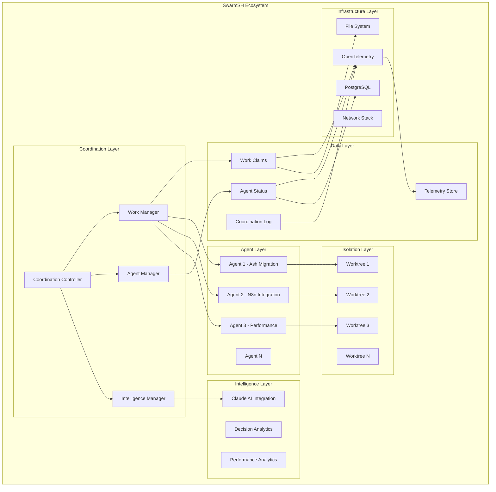

### System Boundaries

- **Internal**: Agent coordination, work distribution, resource management
- **External**: Claude AI API, OpenTelemetry collectors, Git repositories
- **Interfaces**: Shell command API, JSON data formats, HTTP endpoints

---

## Architectural Principles

### 1. Distributed Coordination
- **Principle**: Enable multiple agents to coordinate without central bottlenecks
- **Implementation**: File-based coordination with atomic operations
- **Benefits**: Fault tolerance, scalability, simplicity

### 2. Environment Isolation
- **Principle**: Complete isolation between agent environments
- **Implementation**: Git worktrees with dedicated resources
- **Benefits**: Zero conflicts, parallel development, resource allocation

### 3. Event-Driven Architecture
- **Principle**: Components react to events rather than polling
- **Implementation**: OpenTelemetry spans, JSON event logs
- **Benefits**: Loose coupling, observability, debugging

### 4. Idempotent Operations
- **Principle**: Operations can be safely repeated
- **Implementation**: Nanosecond-precision IDs, atomic file operations
- **Benefits**: Reliability, error recovery, consistency

### 5. Observable Systems
- **Principle**: Full visibility into system behavior
- **Implementation**: Comprehensive telemetry, structured logging
- **Benefits**: Monitoring, debugging, performance optimization

---

## Core Components

### 1. Coordination Controller (`coordination_helper.sh`)

**Purpose**: Central coordination system managing agent interactions

**Responsibilities**:
- Agent registration and lifecycle management
- Work item creation and distribution
- Progress tracking and completion
- Conflict resolution
- Performance monitoring

**Key Functions**:
```bash
register()      # Agent registration
claim()         # Work item claiming
progress()      # Progress updates
complete()      # Work completion
dashboard()     # Status monitoring
```

**Data Structures**:
- Agent Status Registry (JSON)
- Work Claims Database (JSON)
- Coordination Log (JSON)
- Telemetry Spans (JSONL)

### 2. Agent Swarm Orchestrator (`agent_swarm_orchestrator.sh`)

**Purpose**: High-level swarm management and deployment

**Responsibilities**:
- Swarm initialization and configuration
- Agent deployment across worktrees
- Health monitoring and scaling
- Resource allocation management

**Architecture**:
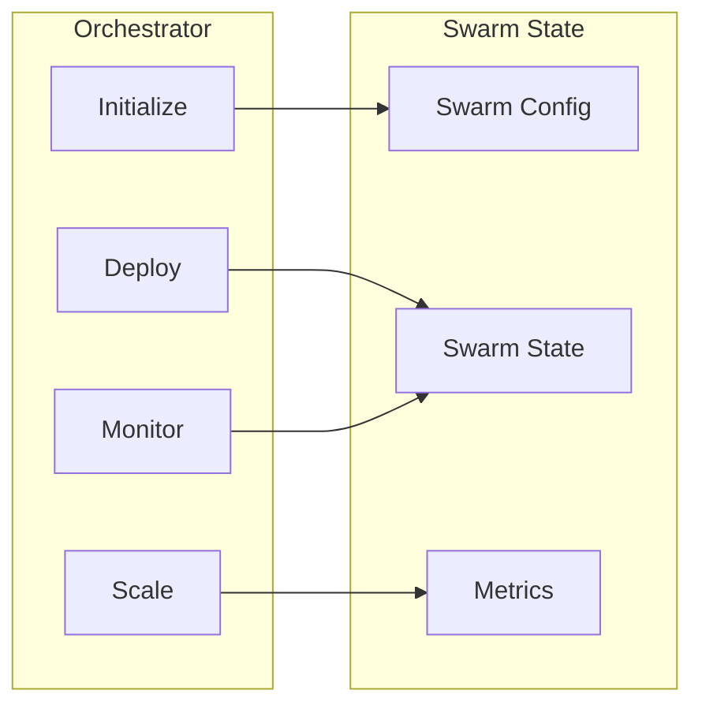

### 3. Worktree Manager (`manage_worktrees.sh`)

**Purpose**: Git worktree lifecycle and resource management

**Responsibilities**:
- Worktree creation and cleanup
- Environment isolation setup
- Resource allocation (ports, databases)
- Health monitoring

**Resource Allocation Model**:
```
Main Application: Port 4000, DB swarmsh_main
Worktree 1:      Port 4001, DB swarmsh_ash_phoenix
Worktree 2:      Port 4002, DB swarmsh_n8n
Worktree 3:      Port 4003, DB swarmsh_performance
```

### 4. Intelligence Manager (Claude Integration)

**Purpose**: AI-powered decision making and optimization

**Responsibilities**:
- Priority analysis and optimization
- Agent assignment recommendations
- Performance monitoring and insights
- Conflict resolution mediation

**Integration Pattern**:
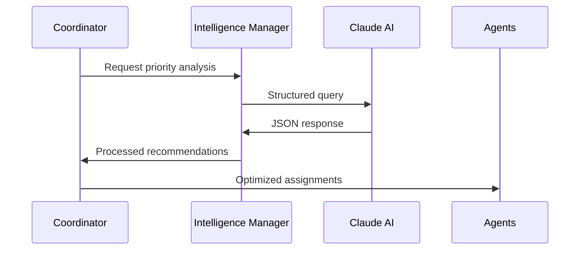

---

## Data Architecture

### 1. Data Storage Strategy

**File-Based Storage**:
- Primary storage: JSON files with atomic operations
- Benefits: Simplicity, version control, human-readable
- Consistency: File locking mechanisms

**Database Integration**:
- Optional PostgreSQL for complex queries
- Primarily for analytics and reporting
- Maintains JSON as source of truth

### 2. Data Flow Architecture

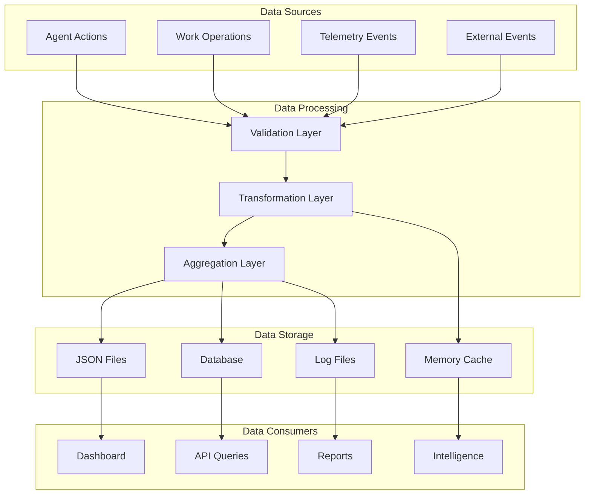

### 3. Data Consistency Model

**Eventual Consistency**:
- Work claims eventually consistent across agents
- Conflict resolution through timestamps and priorities
- Reconciliation through periodic synchronization

**ACID Properties**:
- **Atomicity**: File operations are atomic via locking
- **Consistency**: JSON schema validation
- **Isolation**: Per-worktree data isolation
- **Durability**: File system persistence

---

## Communication Patterns

### 1. Agent-to-Coordinator Communication

**Pattern**: Request-Response via File System

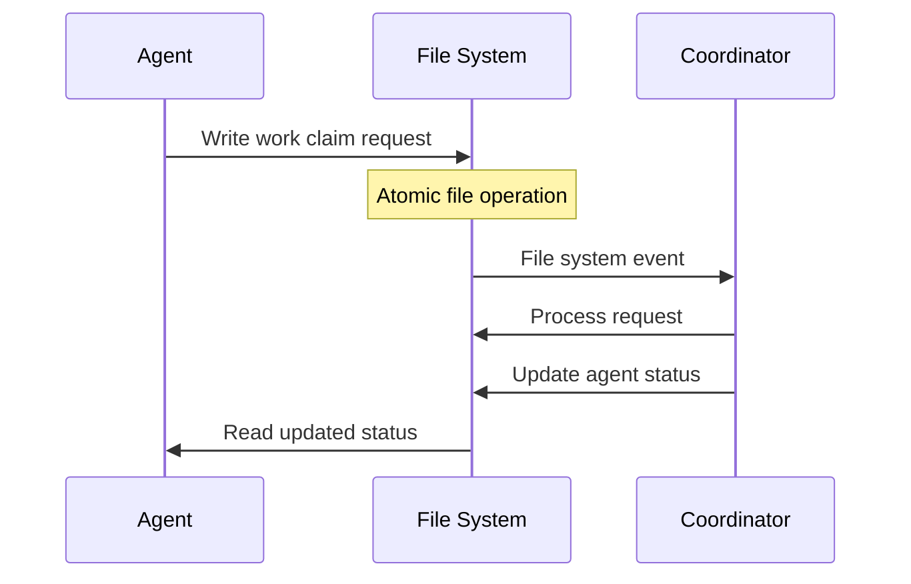

**Benefits**:
- No network dependencies
- Natural conflict resolution
- Audit trail preservation

### 2. Inter-Agent Communication

**Pattern**: Shared State Coordination

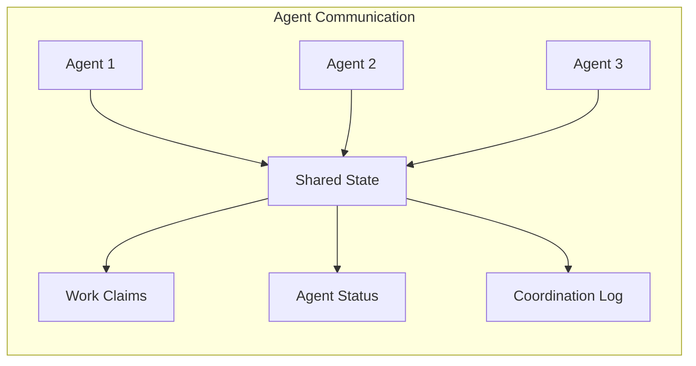

**Conflict Resolution**:
1. Timestamp-based ordering
2. Priority-based selection
3. Claude AI mediation

### 3. External System Integration

**OpenTelemetry Integration**:
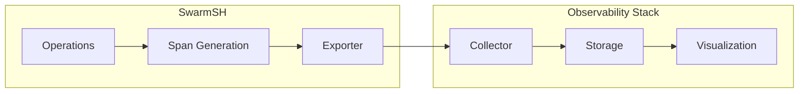

---

## Coordination Mechanisms

### 1. Work Distribution Algorithm

**Priority-Based Distribution**:
```
1. Categorize work by priority (critical, high, medium, low)
2. Match work requirements to agent capabilities
3. Consider agent current workload and capacity
4. Apply load balancing heuristics
5. Use Claude AI for optimization
```

**Implementation**:
```bash
# Simplified algorithm
calculate_agent_score() {
    local skill_match=$1
    local capacity_available=$2
    local priority_weight=$3
    
    score=$((skill_match * 40 + capacity_available * 30 + priority_weight * 30))
    echo $score
}
```

### 2. Conflict Resolution Strategy

**Three-Tier Resolution**:

1. **Automatic Resolution**: Timestamp-based ordering
2. **Priority Resolution**: Business rule-based selection
3. **Intelligent Resolution**: Claude AI mediation

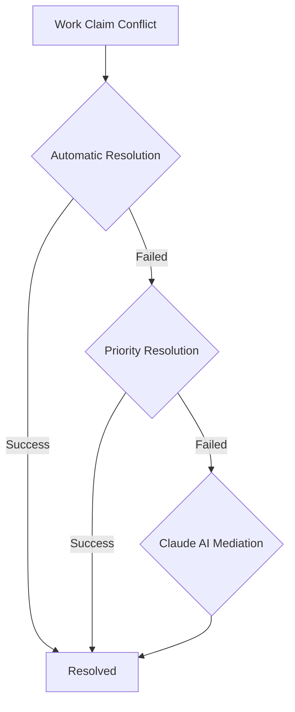

### 3. Agent Health Monitoring

**Health Check Hierarchy**:
```
1. Heartbeat monitoring (60s intervals)
2. Work progress validation
3. Resource utilization checks
4. Performance trend analysis
```

**Health State Machine**:
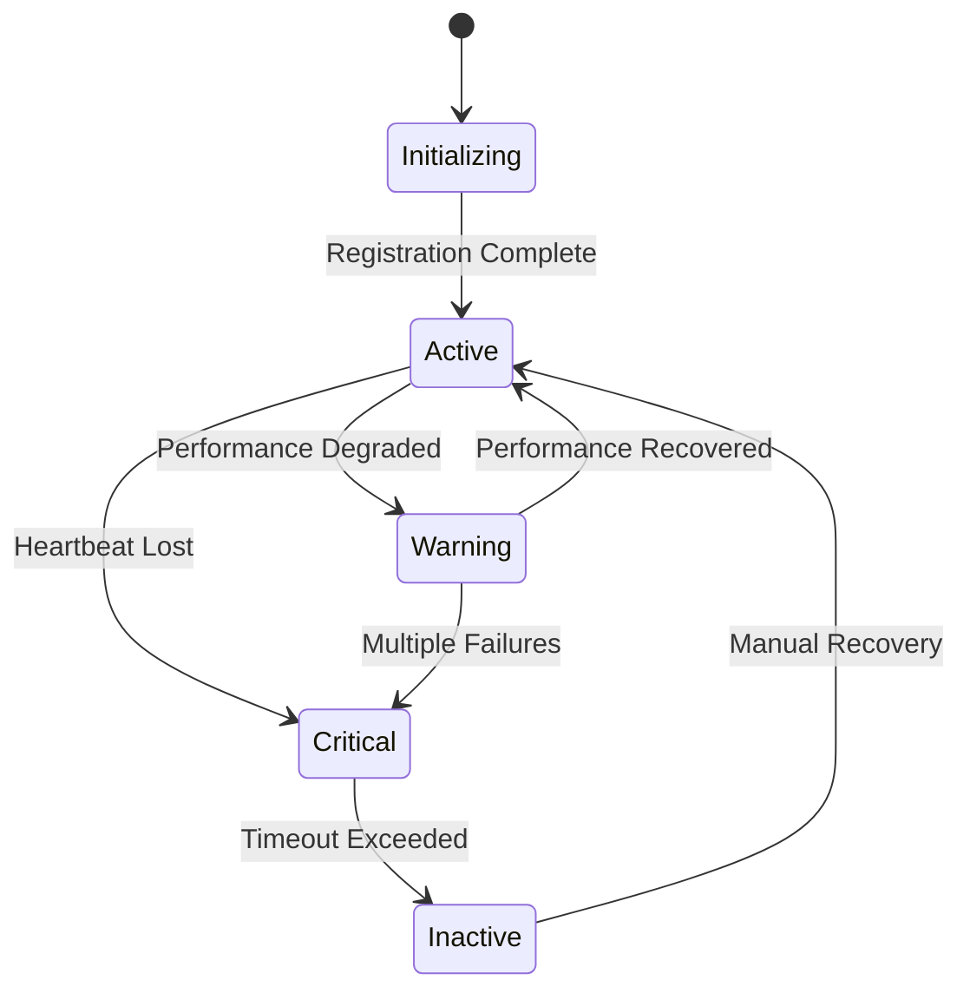

---

## Worktree Architecture

### 1. Isolation Model

**Complete Environment Isolation**:
- Separate Git worktrees
- Dedicated port allocations
- Isolated database instances
- Independent configuration

**Resource Allocation**:
```json
{
  "worktree": "ash-phoenix-migration",
  "resources": {
    "ports": [4001, 4002, 4003, 4004, 4005],
    "database": "swarmsh_ash_phoenix",
    "cpu_limit": 2.0,
    "memory_limit": "4G",
    "disk_quota": "10G"
  }
}
```

### 2. Worktree Lifecycle

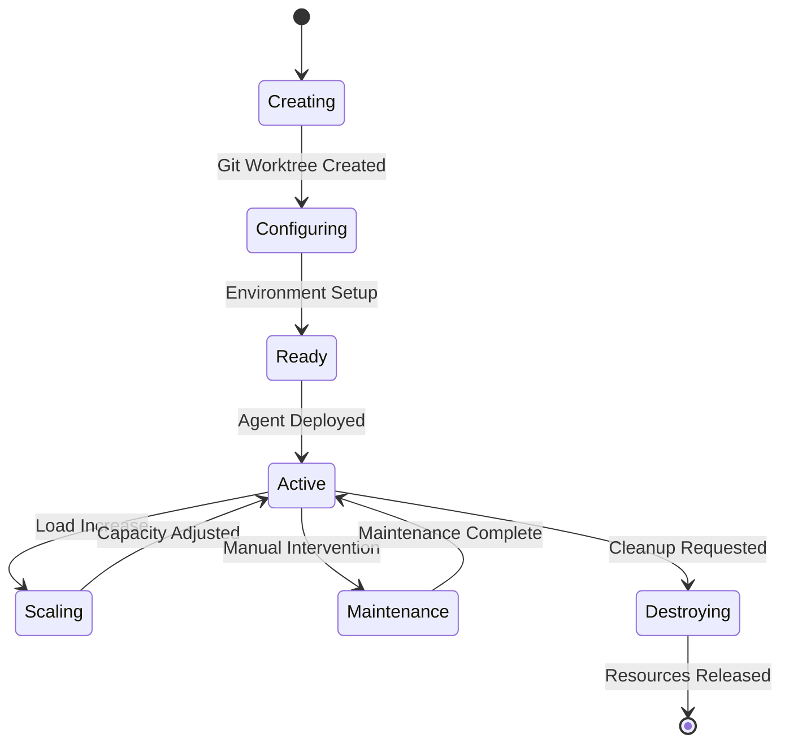

### 3. Cross-Worktree Coordination

**Shared Resource Management**:
- Database schema coordination
- Shared library management
- Test fixture synchronization
- Asset compilation coordination

**Implementation Pattern**:
```bash
# Shared resource coordination
coordinate_shared_resource() {
    local resource_type="$1"
    local operation="$2"
    
    case "$resource_type" in
        "database_schema")
            coordinate_schema_changes "$operation"
            ;;
        "shared_assets")
            coordinate_asset_compilation "$operation"
            ;;
        "test_fixtures")
            coordinate_test_data "$operation"
            ;;
    esac
}
```

---

## Telemetry and Observability

### 1. Observability Stack

**Three Pillars Implementation**:

1. **Metrics**: Performance and capacity metrics
2. **Logs**: Structured event logging
3. **Traces**: Distributed request tracing

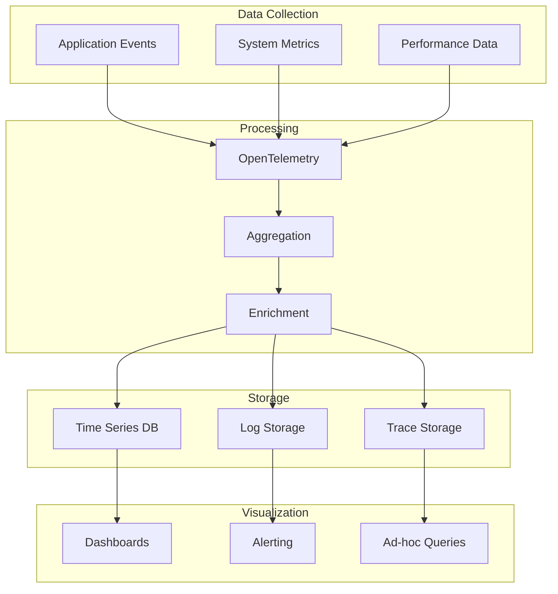

### 2. Trace Correlation Strategy

**Hierarchical Trace Structure**:
```
Swarm Operation (Root Span)
├── Work Distribution (Child Span)
│   ├── Agent Assignment (Child Span)
│   └── Capacity Check (Child Span)
├── Work Execution (Child Span)
│   ├── Task Processing (Child Span)
│   └── Progress Updates (Child Span)
└── Completion Processing (Child Span)
    ├── Quality Validation (Child Span)
    └── Metrics Recording (Child Span)
```

### 3. Metrics Architecture

**Key Performance Indicators**:
- Agent throughput and efficiency
- Work distribution fairness
- System resource utilization
- Error rates and recovery times

**Metric Collection Pattern**:
```bash
record_metric() {
    local metric_name="$1"
    local value="$2"
    local tags="$3"
    
    # OpenTelemetry metric recording
    otel_record_metric "$metric_name" "$value" "$tags"
    
    # Local metric storage
    echo "{\"timestamp\":\"$(date -u +%Y-%m-%dT%H:%M:%S.%3NZ)\",\"metric\":\"$metric_name\",\"value\":$value,\"tags\":$tags}" >> metrics/metrics.jsonl
}
```

---

## Security Architecture

### 1. Security Layers

```mermaid
graph TB
    subgraph "Security Layers"
        AUTH[Authentication Layer]
        AUTHZ[Authorization Layer]
        CRYPT[Encryption Layer]
        AUDIT[Audit Layer]
    end
    
    subgraph "Threat Protection"
        INPUT[Input Validation]
        SANIT[Data Sanitization]
        RATE[Rate Limiting]
        INTRU[Intrusion Detection]
    end
    
    subgraph "Data Protection"
        TRANSIT[Data in Transit]
        REST[Data at Rest]
        BACKUP[Backup Encryption]
        SECRETS[Secret Management]
    end
    
    AUTH --> AUTHZ
    AUTHZ --> CRYPT
    CRYPT --> AUDIT
    
    INPUT --> SANIT
    SANIT --> RATE
    RATE --> INTRU
    
    TRANSIT --> REST
    REST --> BACKUP
    BACKUP --> SECRETS
```

### 2. Threat Model

**Identified Threats**:
1. Unauthorized agent registration
2. Work claim manipulation
3. Data tampering
4. Resource exhaustion attacks
5. Information disclosure

**Mitigation Strategies**:
- File system permissions
- Process isolation
- Input validation
- Audit logging
- Resource quotas

### 3. Secure Communication

**Inter-Component Security**:
- File-based communication with permissions
- JSON schema validation
- Cryptographic signatures for critical operations
- Audit trails for all coordination actions

---

## Deployment Architecture

### 1. Deployment Patterns

**Local Development**:
```
Single Machine
├── SwarmSH Controller
├── Multiple Worktrees
├── Local PostgreSQL
└── File-based Coordination
```

**Container Deployment**:
```
Docker Environment
├── Coordinator Container
├── Agent Containers (1 per worktree)
├── Database Container
└── Telemetry Container
```

**Cloud Deployment**:
```
Kubernetes Cluster
├── Coordinator Pod
├── Agent StatefulSet
├── Managed Database
└── Observability Stack
```

### 2. High Availability Design

**Component Redundancy**:
- Multiple coordinator instances
- Agent health monitoring
- Database replication
- Shared file system (NFS/GlusterFS)

**Failure Scenarios**:
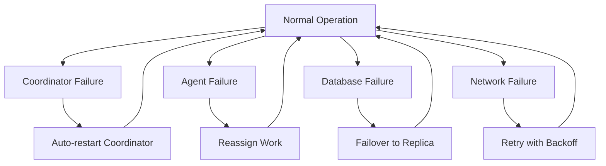

---

## Scalability Design

### 1. Horizontal Scaling

**Scaling Dimensions**:
- Number of agents per worktree
- Number of worktrees
- Coordination throughput
- Data storage capacity

**Scaling Strategies**:
```bash
# Agent scaling
scale_agents() {
    local worktree="$1"
    local target_count="$2"
    
    current_count=$(get_agent_count "$worktree")
    
    if [ "$target_count" -gt "$current_count" ]; then
        scale_up_agents "$worktree" $((target_count - current_count))
    elif [ "$target_count" -lt "$current_count" ]; then
        scale_down_agents "$worktree" $((current_count - target_count))
    fi
}
```

### 2. Performance Optimization

**Optimization Techniques**:
- JSON file sharding
- Memory caching
- Batch operations
- Asynchronous processing

**Performance Monitoring**:
```bash
# Performance metrics collection
collect_performance_metrics() {
    local operation_start=$(date +%s%N)
    
    # Execute operation
    "$@"
    
    local operation_end=$(date +%s%N)
    local duration_ms=$(((operation_end - operation_start) / 1000000))
    
    record_metric "operation_duration" "$duration_ms" "{\"operation\":\"$1\"}"
}
```

### 3. Resource Management

**Resource Allocation Strategy**:
- Dynamic resource allocation based on workload
- Predictive scaling using historical patterns
- Resource quotas and limits
- Automatic cleanup of unused resources

---

## Future Architecture

### 1. Planned Enhancements

**Short-term (3-6 months)**:
- WebSocket-based real-time communication
- Enhanced Claude AI integration
- Advanced conflict resolution algorithms
- Performance optimization framework

**Medium-term (6-12 months)**:
- Microservices decomposition
- Event streaming architecture
- Machine learning for optimization
- Advanced security features

**Long-term (12+ months)**:
- Multi-cluster coordination
- Edge deployment support
- Advanced AI agent capabilities
- Autonomous system evolution

### 2. Architectural Evolution

**Migration Strategy**:
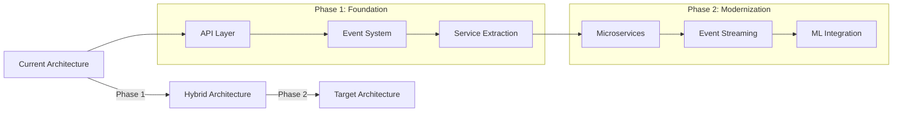

### 3. Technology Roadmap

**Infrastructure Evolution**:
- Container orchestration (Kubernetes)
- Service mesh (Istio/Linkerd)
- Event streaming (Kafka/Pulsar)
- Distributed storage (Ceph/GlusterFS)

**AI/ML Integration**:
- Reinforcement learning for agent optimization
- Natural language processing for work description analysis
- Predictive analytics for resource planning
- Automated testing and quality assurance

---

This architecture document provides a comprehensive view of the SwarmSH system design, patterns, and evolution strategy. It serves as a foundation for development, maintenance, and future enhancements.