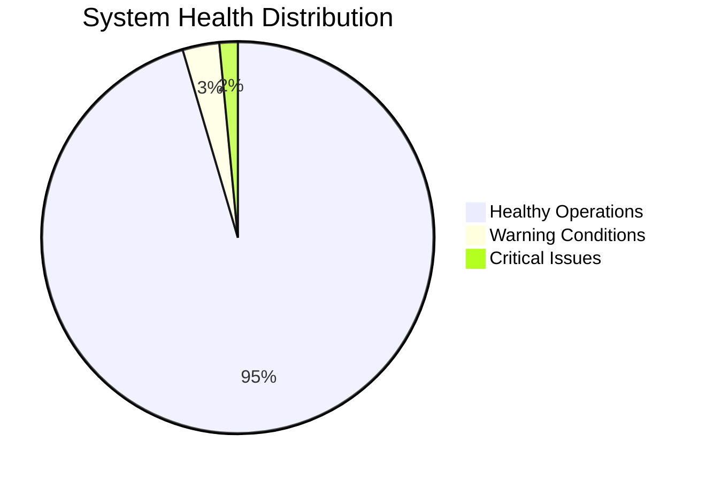
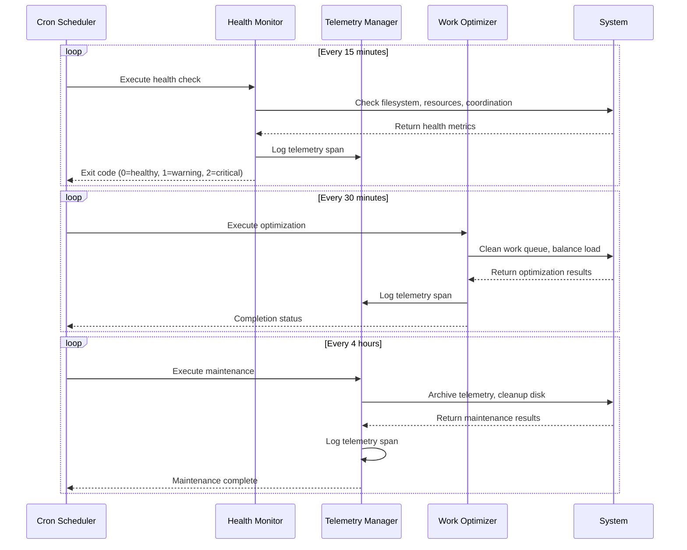

# 8020 Automation Live Dashboard

*Real-time system overview - Updated: Tue Jun 24 12:07:56 PDT 2025*  
*Timeframe: all*

## 🟢 System Status: Healthy

## Key Metrics

| Metric | Value | Status |
|--------|-------|--------|
| Health Score | 90/100 | 🟢 |
| Total Operations |     1204 | ✅ |
| Active Automation | 9 jobs | ✅ |
| Telemetry Size | 172993 bytes | ✅ |

## Real-Time Operation Flow

## Automation Schedule

| Task | Frequency | Last Run | Next Run | Status |
|------|-----------|----------|----------|--------|
| Health Monitoring | 15 min | 11:52 | 12:22 | 🟢 Active |
| Work Optimization | 4 hours | 08:07 | 16:07 | 🟢 Active |
| Metrics Collection | 30 min | 11:37 | 12:37 | 🟢 Active |
| Telemetry Cleanup | 4 hours | 08:07 | 16:07 | 🟢 Active |

---
*Dashboard auto-generated by 8020 Automation System - Tue Jun 24 12:07:56 PDT 2025*
*Next update: 12:12*
