# Real-Time Operations Gantt

*Live system status: Tue Jun 24 15:10:12 PDT 2025*

```mermaid
gantt
    title Live 8020 Cron Operations - 2025-06-24 15:10
    dateFormat  HH:mm
    axisFormat  %H:%M

    section 🏥 Health Monitoring (*/15)
    Current Check         :active, health-now, 15:10, 2m
    Next Check           :health-next, 15:25, 2m
    Following Check      :health-after, 15:40, 2m
    
    section ⚡ Work Optimization (*/4)
    Last Optimization    :done, opt-last, 11:10, 1m
    Next Optimization    :opt-next, 19:10, 1m
    
    section 📊 Metrics Collection (Every 30min)
    Current Metrics      :active, metrics-now, 15:10, 1m
    Next Collection      :metrics-next, 15:40, 1m
    
    section 🧹 Telemetry Management (Every 4h)
    Last Cleanup         :done, cleanup-last, 11:10, 2m
    Next Cleanup         :cleanup-next, 19:10, 2m
```

## Current Automation Status
- **Health Monitoring:** ✅ Standard frequency (15min)
- **Work Optimization:** ✅ Standard cycle (4h)
- **System Health Score:** 75/100
- **Total Operations:**      499 spans

*Real-time data as of: Tue Jun 24 15:10:12 PDT 2025*
