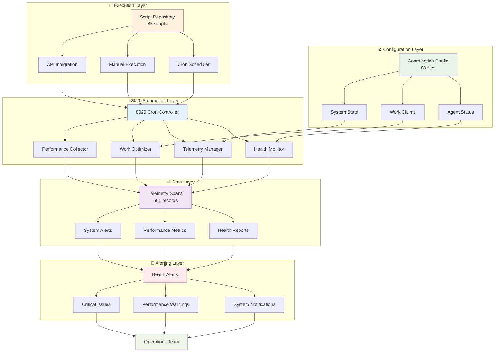

# System Architecture Graph

*Auto-generated architecture overview: Tue Jun 24 15:10:12 PDT 2025*

## Architecture Statistics
- **Automation Scripts:**       85 executable files
- **Configuration Files:**       88 data files
- **Telemetry Records:**      502 spans generated
- **Health Score:** 90/100

*Architecture snapshot: Tue Jun 24 15:10:27 PDT 2025*
