# System Flow Diagram

*Auto-generated: Tue Jun 24 15:09:53 PDT 2025*

```mermaid
flowchart TD
    A[Agent Coordination System] --> B{8020 Cron Automation}
    B --> C[Health Monitor]
    B --> D[Telemetry Manager]
    B --> E[Work Optimizer]
    
    C --> F[Filesystem Check]
    C --> G[Resource Monitor]
    C --> H[Coordination Health]
    
    D --> I[Archive Management]
    D --> J[Disk Space Control]
    D --> K[Performance Reports]
    
    E --> L[Work Queue Cleanup]
    E --> M[Agent Load Balancing]
    E --> N[Priority Optimization]
    
    F --> O[Health Score: 75/100]
    G --> O
    H --> O
    
    O --> P{Score >= 70?}
    P -->|Yes| Q[✅ System Healthy]
    P -->|No| R[⚠️ Generate Alert]
    
    I --> S[📊 Telemetry Data<br/>     496 spans]
    J --> S
    K --> S
    
    L --> T[🎯 Optimized Operations<br/>9 active jobs]
    M --> T
    N --> T
    
    Q --> U[Continue Monitoring]
    R --> V[Health Report Generated]
    
    style A fill:#e1f5fe
    style O fill:#f3e5f5
    style Q fill:#e8f5e8
    style R fill:#ffebee
    style S fill:#f1f8e9
    style T fill:#fff3e0
```

## Real-Time Status
- **Coordination Files:**        3 detected
- **Active Cron Jobs:** 9 automation tasks
- **System Health:** ✅ Operational

*Generated: Tue Jun 24 15:10:07 PDT 2025*
